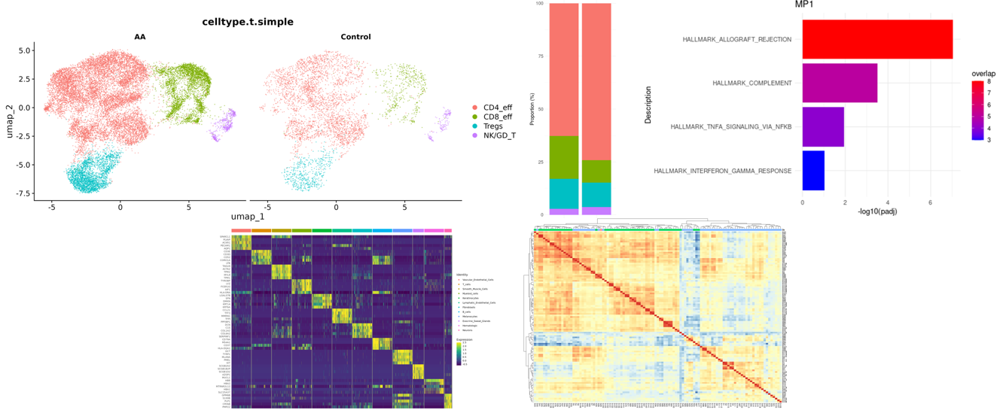

# R2easyviz

[](https://github.com/ryanreis333/R2easyviz/actions/workflows/R-CMD-check.yaml)

> Easy and quick functions for plotting single-cell data in Seurat.

R2easyviz collects the kinds of plots and summaries I find myself making
every day on single-cell projects. Rather than re-deriving the same
metadata wrangling each time, R2easyviz lets you point at a Seurat object
and a few metadata columns and go straight to the figure.



## Installation

### From GitHub (users)

```r
# install.packages("remotes")
remotes::install_github("ryanreis333/R2easyviz")
```

### Dependencies

R2easyviz imports `dplyr`, `ggplot2`, `pheatmap`, `rlang`, `Seurat`,
`stringr`, `tidyr`, and `viridis`. `remotes::install_github()` will pull
these in automatically. If you'd rather install them up front:

```r
install.packages(c(
  "dplyr", "ggplot2", "pheatmap", "rlang",
  "Seurat", "stringr", "tidyr", "viridis"
))
```

## Local development

If you've cloned the repo and want to hack on the package locally:

```r
# install dev tools once
install.packages(c("devtools", "roxygen2", "testthat"))

# from the repo root, in R:
devtools::load_all()       # load the package without installing
devtools::document()       # regenerate NAMESPACE + man/ from roxygen comments
devtools::test()           # run the testthat suite
devtools::check()          # full R CMD check
devtools::install()        # install into your library
```

The repo includes an `renv.lock` for reproducible development
environments. If you use renv, run `renv::restore()` after cloning to
pin the same package versions used during development. renv is **not**
required to install or use the package — it's only for contributors
who want the same toolchain.

## Bug reports / feature requests

If you run into any issues or bugs please open a
[GitHub issue](https://github.com/ryanreis333/R2easyviz/issues) with
details — a [reprex](https://reprex.tidyverse.org/) is hugely helpful.

[Pull requests](https://github.com/ryanreis333/R2easyviz/pulls) are
welcome for bug fixes, new features, or enhancements.

## License

GPL-3. See [LICENSE.md](LICENSE.md).
